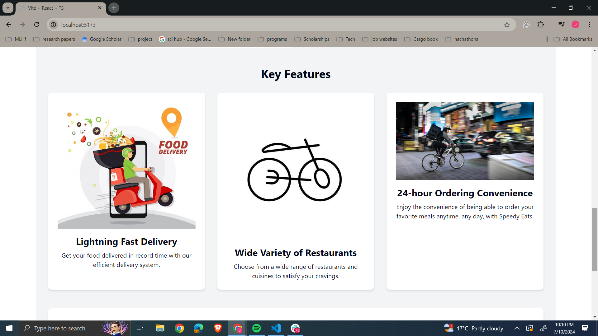

# Enterprise-Level Food Ordering Platform

## Introduction



Welcome to speedyeats food ordering app! This project is a comprehensive solution for online food ordering, catering to both restaurant owners and customers. It provides a seamless and secure way for customers to order food online and for restaurant owners to manage their orders and menus efficiently.

- **Deployed Site:** [speedyeats](https://food-ordering-app-frontend-rkad.onrender.com)
- **Final Project Blog Article:** [Project Blog Article](https://medium.com/@tracysambut/speedy-eats-blog-post-54baf2600080)
- **Authors:** 
  - [Tracy Sambu](https://www.linkedin.com/in/tracysambu/)
  - [Derrick Mungai](https://ke.linkedin.com/in/derrick-njuguna)

## Installation

To set up the project locally, follow these steps:

1. **Clone the repository:**
   ```sh
   git clone https://github.com/sambutracy/food-ordering-app.git
   ```

2. **Navigate to the project directory:**
   ```sh
   cd food ordering app
   ```

3. **Install dependencies for both frontend and backend:**
   ```sh
   # Install backend dependencies
   cd backend
   npm install

   # Install frontend dependencies
   cd ../frontend
   npm install
   ```

4. **Set up environment variables:**
   Create a `.env` file in both the `backend` and `frontend` directories with the required environment variables. Refer to `.env.example` files for the necessary variables.

5. **Run the backend server:**
   ```sh
   cd backend
   npm start
   ```

6. **Run the frontend server:**
   ```sh
   cd ../frontend
   npm start
   ```

The application should now be running on `http://localhost:3000` for the frontend and `http://localhost:7000` for the backend.

## Usage

Once the application is set up and running, you can:

- Browse and search for restaurants.
- View restaurant menus and place orders.
- Register and log in using OAuth via Auth0.
- Restaurant owners can manage their restaurant profiles and menus.
- Make secure payments using Stripe.

## Contributing

We welcome contributions from the community. If you would like to contribute, please follow these steps:

1. Fork the repository.
2. Create a new branch for your feature or bugfix:
   ```sh
   git checkout -b feature/your-feature-name
   ```
3. Make your changes and commit them:
   ```sh
   git commit -m 'Add some feature'
   ```
4. Push to the branch:
   ```sh
   git push origin feature/your-feature-name
   ```
5. Open a pull request.

Please ensure your code follows our coding standards and includes appropriate tests.

## Related Projects

Here are some related projects that might interest you:

- [React](https://reactjs.org/)
- [Vite](https://vitejs.dev/)
- [Auth0](https://auth0.com/)
- [Stripe](https://stripe.com/)
- [Cloudinary](https://cloudinary.com/)
- [MongoDB](https://mongodb.com/)
- [Render](https://render.com/)

## Licensing

This project is licensed under the MIT License - see the [LICENSE](LICENSE) file for details.

---

Thank you for checking out our Enterprise-Level Food Ordering Platform! If you have any questions or feedback, feel free to reach out.
